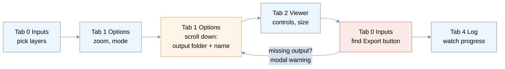

# MapSplat Dock — UX Evaluation & Redesign Proposal

*Status: proposal / design doc. No code changed yet — this is the plan to react to.*
*Scope: the QGIS dock widget (`mapsplat_dockwidget.py`), its screen/field flow, and beginner guidance.*

---

## TL;DR

The dock spreads **one linear task across five tabs in a non-linear order**. The two things
*every* run requires — **selected layers** and an **output folder + project name** — live on **two
different tabs**, and the **Export** button lives with the layers, far from the settings. So a user
configures on the *Options*/*Viewer* tabs, then has to hunt back to *Inputs* to run, and the most
commonly-forgotten required fields (Output folder / Project name) are collapsed and scrolled out of
sight. That is the "jump back and forth / up and down" pain.

**Recommendation:** collapse the five tabs into **one task-ordered vertical panel** with numbered
steps (Layers → Output → Tiles → Viewer → Offline), required steps at the top, optional/advanced
sections collapsed, and a **sticky Export bar with a live readiness checklist** pinned to the bottom.
Then **cut the work to almost nothing**: preload layers, project name, and output folder from the
open QGIS project so the dock opens export-ready (§6). Add lightweight, always-visible guidance
(step subtitles, required markers, a Help ▸ menu linking a PDF user guide). None of this touches the
export logic — it is a re-layout of `_setup_ui` plus a `_prefill_defaults()` seed.

---

## 1. How the dock is built today

Everything is created programmatically in `MapSplatDockWidget._setup_ui()` (there is no `.ui` file).
A single `QTabWidget` holds five tabs:

| # | Tab | Contains | # of controls |
|---|-----|----------|---------------|
| 0 | **Inputs** | Layer list + Select All/None + count · `▸ Advanced Options` (style-only, save-log) · Save/Load Config · **Export button** | ~7 |
| 1 | **Options** | *scroll area* → `▾ Export Options` (PMTiles mode, max zoom, tile estimate, style.json, extent, import style) · `▸ Basemap Overlay` (a collapsible **wrapping a checkable group**) · `▾ Output` (**project name, output folder**) | ~12 |
| 2 | **Viewer** | Map Controls (7 checkboxes + label placement + legend + attribution) · Map Dimensions (preset + W/H) | ~12 |
| 3 | **Offline** | One checkbox + a paragraph of note | 1 |
| 4 | **Log** | Progress bar + Cancel · status label · log text | — |

**Required for any run** (`_validate_export`): ≥1 layer (tab 0), output folder (tab 1), project name
(tab 1), and — only if basemap is on — a basemap source + style. Notice the required fields already
straddle tabs 0 and 1.

---

## 2. Walking a real export — the ping-pong



Four tab switches and a backtrack for a single export — and if Output was missed, a modal warning
sends the user *back* to a collapsed section on tab 1.

---

## 3. Problems, ranked

1. **Required fields are split across tabs.** Layers (tab 0) and Output folder + Project name
   (tab 1, collapsed, inside a scroll area) are both mandatory but nowhere near each other.
2. **The primary action is divorced from the settings.** The big green **Export** button is on
   tab 0, but nothing you configure to enable it (output, zoom, viewer) is on tab 0.
3. **Validation is after-the-fact and modal.** You only learn Output is missing *after* clicking
   Export, via a `QMessageBox` — then you must navigate to find the field.
4. **Tab weighting is inverted.** *Offline* is a whole tab for **one checkbox**, while *Viewer*
   crams ~12 controls into one screen. Tabs are organised by code module, not by user task.
5. **Double-nested basemap.** `▸ Basemap Overlay` (collapsible) wraps a **checkable** `Enable
   basemap` group — two separate "turn it on" gestures for the same thing.
6. **Deep nesting = lots of scrolling.** Tab 1 is scroll-area → collapsible toggle → group box →
   nested rows. This is the "up and down on the controls" half of the complaint.
7. **"Inputs" is a grab-bag.** It holds inputs *and* advanced options *and* config I/O *and* the
   run button — the name tells a beginner nothing about where Output or Zoom live.
8. **No orientation for newcomers.** No one-line "what this does / what you'll get", no
   required-vs-optional cues, no visible help or link to a guide. Tooltips are good but hidden
   until hover, and never seen by someone who doesn't know to hover.

---

## 4. Proposed layout

### Recommended — one task-ordered panel with a sticky Export bar

Replace the tab widget with a single vertical, top-to-bottom flow. Required steps are always
visible at the top; optional and advanced blocks are collapsible; the run controls and a **live
readiness checklist** are pinned to the bottom so they are visible from any scroll position.

```
┌ MapSplat · Export Web Map ───────────────────────────┐
│ Turn selected QGIS layers into a self-contained       │  ← 1-line intro
│ web map (PMTiles + MapLibre).      [ Help ▾ ] [ ⚙ ▾ ] │  ← help menu + config I/O
├───────────────────────────────────────────────────────┤
│ ① Layers to export                        *required*  │
│   ┌───────────────────────────────┐  [All] [None]     │
│   │ ☑ roads                        │  3 of 8 selected  │
│   │ ☑ parcels · ⚠ 12k feat         │                   │
│   └───────────────────────────────┘                   │
│                                                        │
│ ② Output                                  *required*  │
│   Project name  [ my_webmap        ]                   │
│   Folder        [ /maps          ] [Browse]           │
│                                                        │
│ ③ Tiles & style                        (good defaults) │
│   PMTiles mode [Single ▾]   Max zoom [ 6 ▹]           │
│   ~1,240 tiles · ~5 MB                                  │
│   ▸ Basemap overlay (optional)                         │
│   ▸ Style & extent (advanced)                          │
│                                                        │
│ ④ Viewer  (optional)                                  │
│   ▸ Map controls, legend, attribution                  │
│   ▸ Map dimensions                                     │
│                                                        │
│ ⑤ Offline  (optional)                                 │
│   ☐ Bundle JS/CSS so the map works with no internet    │
├───────────────────────────────────────────────────────┤  ← sticky footer
│ Ready ✓ layers  ✓ output  ✓ name                      │  ← live checklist
│ [        Export Web Map        ]  [ Open Folder ]      │
│ progress ▓▓▓▓▓░░░░  (appears during a run)             │
└───────────────────────────────────────────────────────┘
```

Why it fixes the complaint:

- **No tab switching** — the whole run is one glance and one scroll, in the order you actually do it.
- **Required first, optional collapsed** — the two mandatory steps are the first two blocks; the
  four optional areas (basemap, style, viewer, offline) are collapsed by default, so the panel is
  short until you opt in.
- **Export is always reachable** and its **readiness checklist** tells you what's missing *before*
  you click — the modal warnings become a fallback, not the primary feedback.
- **Config I/O and log** stop being peers of the task: Save/Load Config move into a small `⚙` menu;
  the log appears inline in the footer during a run (no dedicated tab to babysit).

### Flow after the change

```mermaid
---
config:
  theme: base
  themeVariables:
    background: "#ffffff"
    primaryColor: "#ebf5ff"
    primaryTextColor: "#000000"
    primaryBorderColor: "#8c939b"
    lineColor: "#7c96bb"
    secondaryColor: "#d7e1ee"
    tertiaryColor: "#c3d2e5"
    fontFamily: "\"Inter\", \"Noto Sans SC\", sans-serif"
    fontSize: "16"
  themeCSS: |
    .node rect, .node polygon { rx: 6px !important; ry: 6px !important; }
    .node .label { font-family: -apple-system, BlinkMacSystemFont, "Segoe UI", sans-serif; }
    .edgeLabel { color: #64748b; font-size: 13px; }
    /* mm:radius:start */
    .node rect, .node polygon, .cluster rect { rx: 9px !important; ry: 9px !important; }
    /* mm:radius:end */
---
graph LR
    A["① Layers"] --> B["② Output"]
    B --> C["③ Tiles<br/>(defaults ok)"]
    C -.optional.-> D["④ Viewer"]
    D -.optional.-> E["⑤ Offline"]
    E --> F["Export<br/>(sticky, live-validated)"]
    C --> F
    style F fill:#e8f5e9,stroke:#66bb6a
```



### Alternatives (with trade-offs)

| Option | What it is | Effort | Trade-off |
|---|---|---|---|
| **A — Single panel (recommended)** | Collapse tabs into one numbered vertical flow + sticky Export/readiness footer | Medium | Biggest layout change; best fix; long-ish scroll if everything is expanded |
| **B — Reorder tabs + persistent footer** | Keep tabs but reorder to workflow (Layers → Output → Map → Viewer → Run) and put the Export button + checklist in a footer visible on **every** tab; merge Offline into Options; move Output to the top | Low | Least disruptive; still some tab switching, but the run button and required fields stop being stranded |
| **C — Wizard / stepper** | Next/Back through numbered pages with a progress rail, plus an "expert" all-in-one mode | High | Great for first-timers, slower for repeat users; more code + state to maintain |

Recommendation: **A**, with **B** as the fallback if we want a smaller, lower-risk first pass (B is
essentially A's footer + reordering applied to the existing tabs, so it's a stepping stone).

---

## 5. Control-level adjustments

| Control | Today | Proposed change |
|---|---|---|
| **Output folder / Project name** | Collapsed `▾ Output` at bottom of tab 1 scroll area | Promote to **Step ②**, always visible, directly under Layers |
| **Export button** | Tab 0, away from settings | Sticky footer, next to the readiness checklist |
| **Basemap** | `▸ Basemap Overlay` collapsible wrapping a checkable `Enable basemap` group | **One** control: a single collapsible whose header checkbox *is* the enable. Kill the double toggle |
| **Offline tab** | Whole tab for 1 checkbox | Demote to collapsible **Step ⑤**; keep the explanatory note |
| **Viewer controls** | 7 loose checkboxes + 3 combos in one group | Sub-group: "Buttons" (scale/geolocate/fullscreen/reset/north), "Readouts" (coords/zoom), "Labels & legend", "Branding" (attribution) — same controls, scannable |
| **Max zoom** | Spinbox 4–18, default 6 | Keep, but add an inline hint band ("6–10 typical; 14+ can take hours") and keep the live tile estimate right beneath it |
| **Advanced Options** (style-only, save-log) | Collapsible on tab 0 | Move under Step ③ "advanced" with the other advanced items |
| **Save/Load Config** | Buttons on tab 0 | `⚙` menu in the header |
| **Progress / Log** | Dedicated tab 4; export jumps focus there | Inline in the footer during a run; a `Show full log ▸` expander for the text pane |
| **Tile estimate** | Small grey label | Keep, but surface as a chip next to Max zoom so cause/effect is adjacent |

Everything above is a **re-parenting / reordering** of existing widgets — the signals, the exporter,
and `_validate_export` stay as-is. `_validate_export`'s checks become the source for the live
checklist (same conditions, surfaced continuously instead of only on click).

---

## 6. Fewer clicks — defaults, preloading & autofill

The fastest export is the one you don't have to configure. The dock **already remembers ~24 settings**
between sessions via `QgsSettings` (`_save_settings`/`_restore_settings`) — zoom, every viewer toggle,
basemap, output folder — so a *repeat* run is nearly one click. The gap is the **first** run and the
**required** fields that are neither defaulted nor preloaded. Close those and the dock opens
export-ready.

### The zero-config happy path

Goal: open the dock on a saved project that has vector layers → the readiness checklist is **already
green** → click **Export**. Reached by preloading:

| Field | Today | Proposed default / preload | Source (with fallback) |
|---|---|---|---|
| **Layers** | nothing selected | preselect the **checked/visible** layers in the QGIS layer tree (or the active layer; or all if ≤ ~5) | `layerTreeRoot().checkedLayers()` → `iface.activeLayer()` → all vector |
| **Project name** | **blank, not even remembered** | prefill from the **QGIS project name** | `QgsProject.instance().baseName()` → `"webmap"` |
| **Output folder** | last-used if it still exists, else blank | default to the **project folder** on first run | `QgsProject.instance().homePath()` → OS Documents |
| **Attribution** | remembered only | prefill from **project author / title** | `QgsProject.instance().metadata().author()`/`.title()` |
| Max zoom · mode · extent · viewer · dimensions | already sensible (6 · single · full extent · all-on · responsive) | keep | — |

Result: on a saved project, ① Layers and ② Output (name + folder) arrive pre-filled, so **Export is
enabled the moment the dock opens** — the readiness checklist (§4) is green with zero input.

### Make "turn on basemap" free

Enabling the basemap today adds **two** required fields (source + `style.json`). Drop it to zero:

- **Bundle a default basemap `style.json`** in the plugin (e.g. `assets/basemap_style.json`) and use it
  as the default for `txt_basemap_style`.
- **Default the source** to a known Protomaps build URL (the placeholder already shows one — make it the
  real value), or better, offer a **dropdown of recent Protomaps builds** so users pick instead of paste.
- Net: ticking **Basemap** just works; the source/style fields become overrides, not prerequisites.

### Easy ways to fill in the rest

- **Prefill, never blank.** Every field opens with a best-guess value the user can overwrite — no empty
  required boxes.
- **Quick buttons** where a guess might be wrong: beside Output → `Use project folder` · `Use Documents`;
  beside Extent → `Use current map view` (wire the existing `_capture_canvas_bounds`).
- **"Quick Export" action** — a toolbar button and a layer-tree right-click *"Export as web map"* that
  runs immediately on the current selection with all defaults. The true minimum path: no dock trip at all.
- **Per-project memory.** Persist the export config **into the project** (via the existing
  `config_manager` `.toml` or `QgsProject` custom properties), so reopening a project restores *its* last
  export setup — while global `QgsSettings` stays the cross-project default. First run seeds from the
  project; repeat runs seed from last time; the box is never empty and rarely wrong.
- **Smart collision handling.** If `<name>_webmap/` already exists, auto-suggest `<name>_2` up front
  instead of failing at the end of a long run.

### What this costs in code

- Add one `_prefill_defaults()` after `_restore_settings()` that fills `txt_project_name`,
  `txt_output_folder`, attribution, and the initial layer selection **only when** the persisted value is
  empty — so it never clobbers a remembered choice.
- Add `project_name` to `_save_settings`/`_restore_settings` (it's currently missing).
- Preselect in `refresh_layer_list()` using `checkedLayers()`.
- Bundle `assets/basemap_style.json` and default the basemap style to it.

All additive; no changes to `exporter.py` or the export logic.

---

## 7. Beginner guidance & help (the second ask)

Guidance should be **visible without hovering** and **layered** (glanceable → tooltip → full guide):

1. **Header intro line** (always visible): *"Turn selected QGIS layers into a self-contained web map
   (PMTiles + MapLibre viewer) you can open in any browser."*
2. **Step subtitles** — one muted line under each numbered header:
   - ① *"Pick the vector layers to publish. Their QGIS styles and labels are read automatically."*
   - ② *"Where to write the map. A folder `<name>_webmap/` is created here."*
   - ③ *"How the tiles are built. Defaults work for most maps — only change if you know you need to."*
3. **Required vs optional cues** — a red `*required*` on ①/②; a muted `optional · sensible defaults`
   on ③–⑤. Mirror this on the Export button state.
4. **Live readiness checklist** (footer) — replaces "click, then get a modal":
   `Layers ✓   Output folder ✓   Project name ✗ — enter a name to enable Export`.
   The Export button stays disabled with a one-line reason until green.
5. **Empty-state hints** — when the layer list is empty: *"No vector layers in this project — add one
   in QGIS, then click Refresh."* When Output is blank: inline helper text, not just a placeholder.
6. **`?` help affordances** on the genuinely non-obvious fields (Max zoom, PMTiles mode, Basemap
   source, Label placement) — a small info button that pops a 2–3 line explainer and a "Learn more"
   link into the guide. (Promotes today's hidden tooltips into discoverable help.)
7. **`Help ▾` menu** in the header:
   - *Quick start* (opens an inline first-run panel),
   - *Requirements* (PMTiles CLI, internet for basemap) — reuse `docs/REQUIREMENTS.md`,
   - *Open User Guide (PDF)* — ship a `docs/MapSplat_User_Guide.pdf` and open it with
     `QDesktopServices.openUrl(QUrl.fromLocalFile(...))`; there's precedent (`docs/BACKLOG_ANALYSIS.pdf`)
     and existing screenshots (`docs/images/ms4_*.png`, `mapsplat_config.png`) to build it from,
   - *Online docs* — open the project page in a browser.
8. **First-run banner** — a dismissible strip at the top on first open: *"New to MapSplat? Start with
   ① Layers and ② Output — everything else has good defaults. See the Guide ▸."* Persist the dismissal
   in `QSettings`.
9. **Pre-flight summary** — when everything is green, the footer reads a plain-English sentence:
   *"Ready: 3 layers → `/maps/my_webmap/`, zoom ≤6, no basemap."* so the user confirms intent before
   the run.

A short **`docs/USER_GUIDE.md`** (→ exported to the PDF above) should cover: what MapSplat produces,
the PMTiles CLI prerequisite, the 2 required + optional steps, the basemap workflow, and how to serve
the output. It can lift the existing screenshots and `REQUIREMENTS.md`.

---

## 8. Implementation notes

- **Low risk.** This is a layout refactor of `_setup_ui()`; widget objects, their `self.*` names,
  signal connections, `config_manager`, and `exporter` are untouched, so `_save_config`/`_load_config`
  and the tests keep working. Keep every `self.<widget>` attribute name.
- **Mechanics.** Swap the `QTabWidget` for a `QScrollArea` → `QVBoxLayout` of section frames; reuse
  the existing collapsible `QToolButton` pattern already in the file for ③–⑤; move the Export/progress
  row out of `inputs_tab` into a footer widget added to `self.main_layout` *after* the scroll area so
  it stays pinned.
- **Readiness checklist.** Extract the conditions in `_validate_export` into a `_run_readiness()`
  helper returning `(ok: bool, missing: list[str])`; call it on the same signals that already fire
  (`itemSelectionChanged`, `textChanged`, basemap toggles) to update the footer + Export enabled state.
- **Phasing.** (1) **Prefill defaults + Export/readiness footer + move Output up** — highest impact,
  least code; on its own it removes most of the required typing and the tab backtrack. (2) Merge tabs
  into the single panel / collapsibles. (3) Guidance: subtitles, required markers, Help menu + PDF,
  first-run banner. (4) Basemap default style + Quick Export + per-project memory.
- **Effort.** Phase 1 ≈ small; full Option A ≈ medium; guidance ≈ small–medium and can land
  incrementally. No change to exporter, tests, or the plugin's security posture.

---

## Appendix — full current control inventory

- **Inputs:** `layer_list` (multi-select), `btn_select_all`, `btn_select_none`, `lbl_layer_count`;
  `▸ Advanced`: `chk_style_only`, `chk_save_log`; `btn_save_config`, `btn_load_config`; `btn_export`,
  `btn_open_folder`.
- **Options:** `combo_export_mode`, `spin_max_zoom`, `lbl_tile_estimate`, `chk_export_style`,
  `combo_extent_layer`, `btn_import_style`/`lbl_imported_style`; basemap: `basemap_group` (checkable),
  `radio_basemap_url`/`radio_basemap_file`, `txt_basemap_source`+`btn_basemap_browse`,
  `txt_basemap_style`+`btn_basemap_style_browse`; output: `txt_project_name`, `txt_output_folder`+`btn_browse`.
- **Viewer:** `chk_viewer_scale_bar`, `chk_viewer_geolocate`, `chk_viewer_fullscreen`,
  `chk_viewer_coords`, `chk_viewer_zoom_display`, `chk_viewer_reset_view`, `chk_viewer_north_reset`,
  `combo_label_placement`, `chk_advanced_legend`, `txt_viewer_attribution`; `combo_dim_preset`,
  `spin_map_width`, `spin_map_height`.
- **Offline:** `chk_bundle_offline` (+ note).
- **Log:** `progress_bar`, `btn_cancel`, `lbl_export_status`, `txt_log`.
