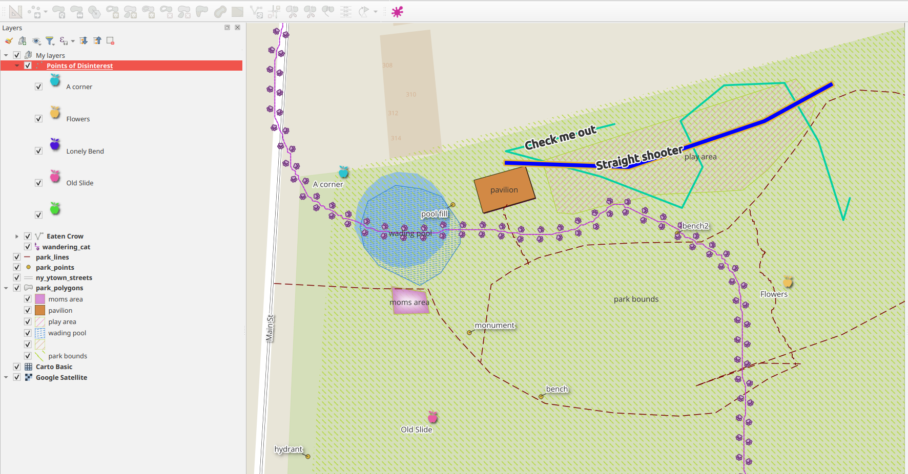
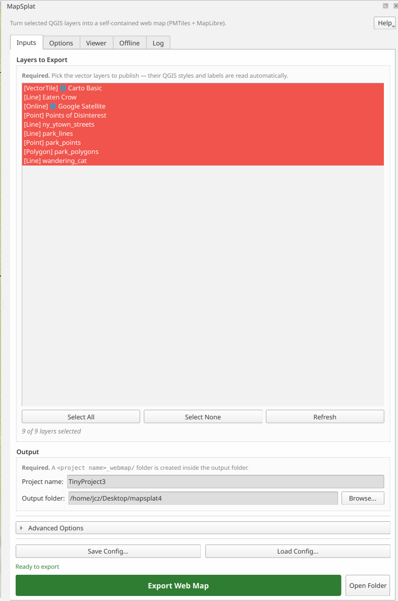
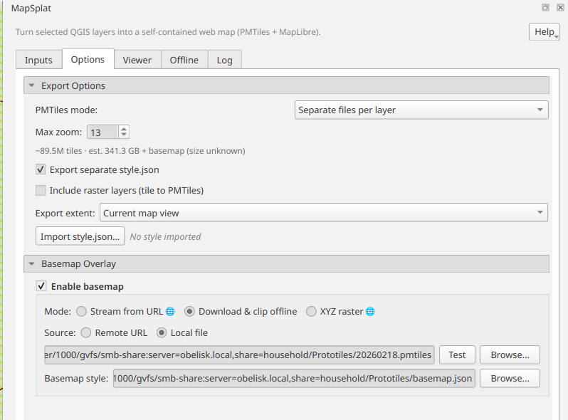
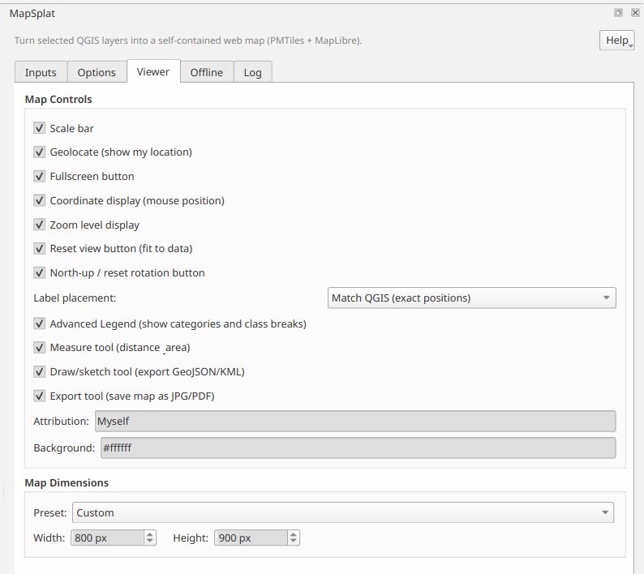
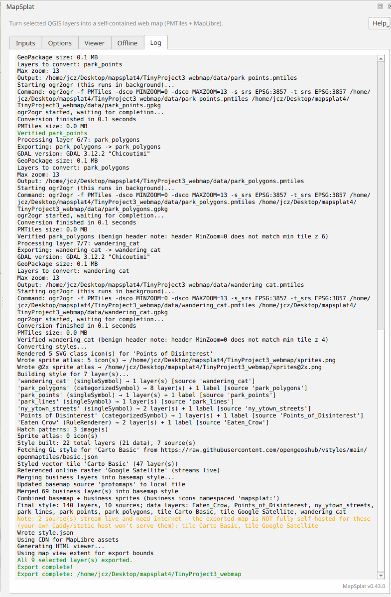
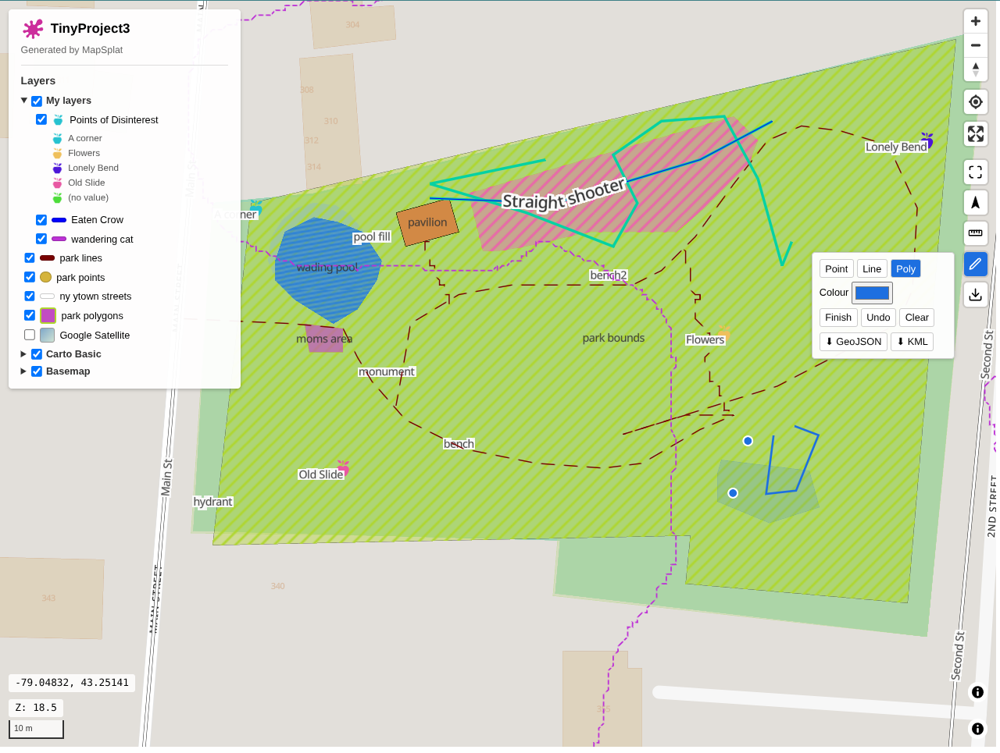

# MapSplat Screenshots

A walk-through of MapSplat, from a styled QGIS project to a finished, self-contained web map.
Screenshots are from MapSplat **v0.43.0**.

---

## 1. The source project in QGIS

Style your layers in QGIS as you normally would — fills, strokes, dashed lines, categorized and
graduated markers, labels, and layer groups. MapSplat reads this symbology directly. The layer-tree
order and groups (here a **My layers** group with *Points of Disinterest*, *wandering_cat*,
*park_polygons*, etc., plus a **Carto Basic** vector-tile layer and a **Google Satellite** XYZ layer)
are carried through to the web map.

## 2. Inputs tab — pick your layers

Tick the layers to export. Type tags show what each layer is (`[Polygon]`, `[Line]`, `[Point]`,
`[VectorTile]`, `[Online]`); an online tag marks layers that stream live and need internet. Set the project
name and output folder, then **Export Web Map**. Save/Load Config lets you iterate on settings.

## 3. Options tab — export & basemap

Choose single-file or separate PMTiles per layer, a max zoom (with a live tile-count estimate),
whether to include raster layers, and the export extent. Add a **basemap**: stream a Protomaps
PMTiles URL, download-and-clip it for offline use, or use an **XYZ raster** provider.

## 4. Viewer tab — map controls & tools

Turn on the controls and optional on-map tools that ship in the exported viewer: scale bar,
geolocate, fullscreen, coordinate/zoom readouts, reset/north buttons, label placement, an advanced
legend, and the **Measure**, **Draw/sketch (GeoJSON/KML)**, and **Export (JPG/PDF)** tools. Set the
attribution, background, and map dimensions here too.

## 5. Log tab — the export

The Log tab streams every step and ends with a summary (`All 9 selected layer(s) exported`). It records
the plugin version, PMTiles verification, and — new in recent releases — fetching a vector-tile
layer's own GL style (e.g. Carto) and flagging any sources that stream live and need internet.

## 6. The exported web map

`python serve.py` opens the finished map. It's a self-contained MapLibre + PMTiles page: a collapsible
**layer list** with per-layer and per-group on/off toggles (your **My layers** group, plus **Carto
Basic** and **Basemap** collapsed at the bottom), the on-map tools (here the **Draw** tool exporting to
GeoJSON/KML), popups, and your QGIS styling faithfully reproduced. Layer stacking matches your QGIS
layer tree.

---

See the [main README](../../README.md) for the quick start, and
[`docs/USER_GUIDE.md`](../USER_GUIDE.md) for the full walk-through.
